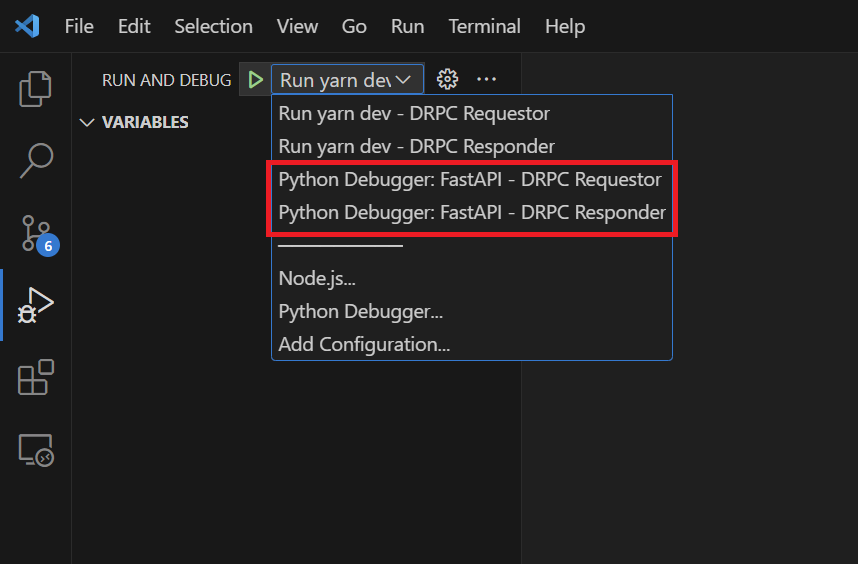
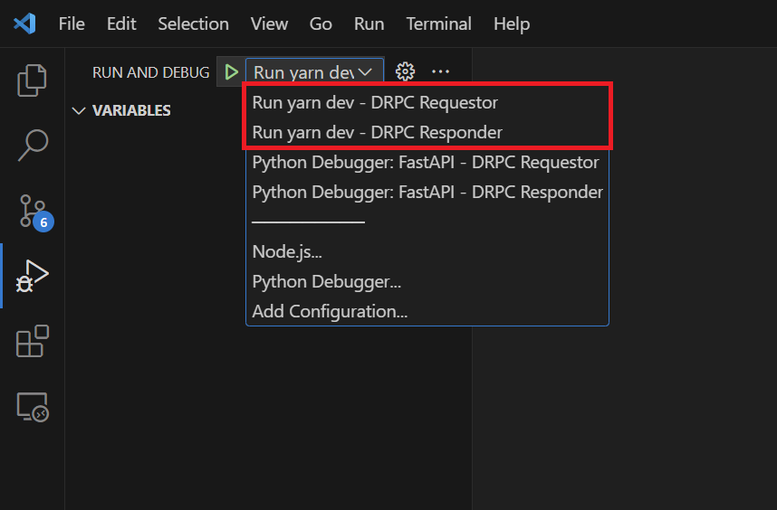
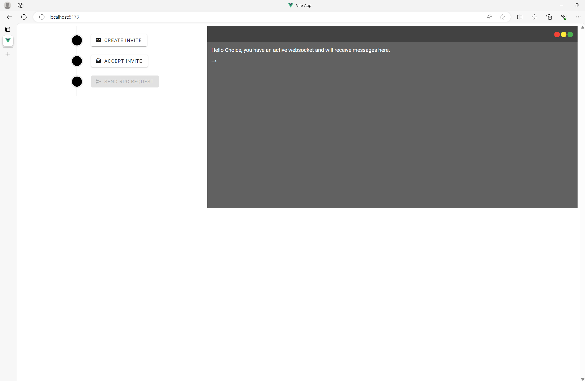
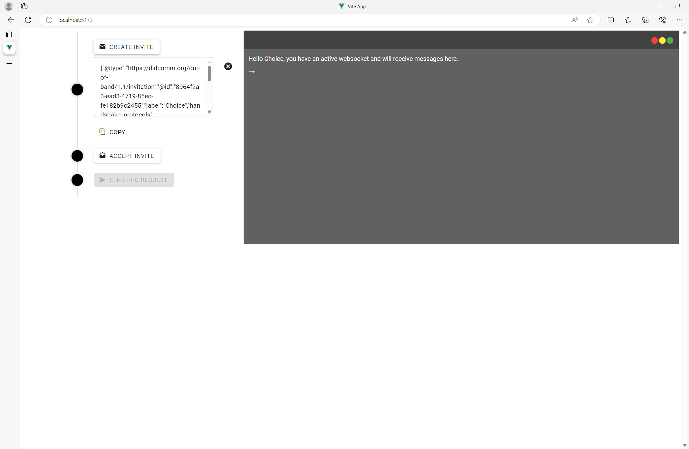
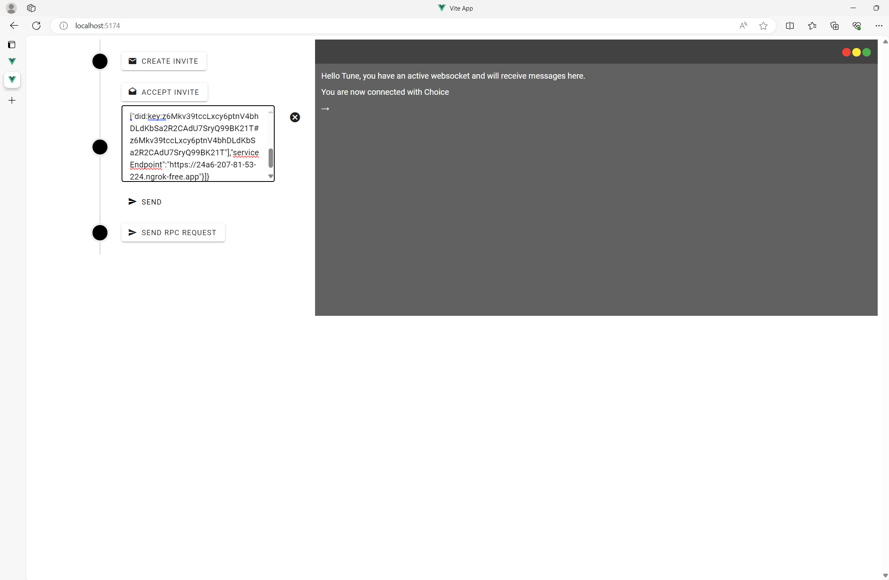

# RPC Plugin Demo

## Requirements

Ensure you have Traction running locally. Please see the Traction [documentation](https://github.com/bcgov/traction/tree/main/scripts#run-local-traction) for instructions on how to run Traction locally with Docker.

## Install instructions

These instructions assume you will run this demo in a VSCode devcontainer as it will build in all of the requirements for it. You will simply need to initialize the Controller and the Web application to run the demo.

### Controller (FastAPI)

To initialize the Controller, run the following commands from the root of this directory in a terminal:

```sh
cd controller/
source .venv/bin/activate
poetry install --no-root --all-extras
```

Once the dependencies are installed you should be able to launch debug sessions for a Requestor and Responder controller.



### Web application (Vue)

In another terminal, run the following commands from the root of this directory

```sh
cd app/
yarn
``` 

Once the dependencies are installed you can launch debug sessions for the Requestor and Responder frontends.



## DEMO

If startup has been successfull you will have:

1. A Traction instance running
2. A Requestor controller
3. A Requestor frontend running on http://localhost:5173
4. A Responder controller
5. A Responder frontend running on http://localhost:5174

Open up your browser and navigate to the address for the Requestor. As part of the startup process, a tenant is automatically provisioned for you. It will have a random name. The console displayed in the browser will indicate that you have a websocket connection with the controller to receive push messages.



On the left you will see some options to create and accept a connection invite. Create an invite and copy the message that is generated. 



Navigate over to the address for the Requestor, click "Accept Invite", paste the message and click "Send". You will see a message in the console that you are connected to the Requestor. Similarly the console of the Requestor will show that you have connected to the Responder.



You will now see a button to "Send RPC Request" between the two entities. Go ahead and experiment sending different RPC requests to either side of the connection. Select an "RPC Request Type" from the first dropdown, a connection ID from the second (there will only be one connection for either the Requestor or Responder) and hit "Send". Results from a valid RPC request will display in the console. Sending an invalid RPC rquest may result in an error message displayed on the console, and if not, in the payload from the API request in the browser dev tools, indicating what went wrong.

